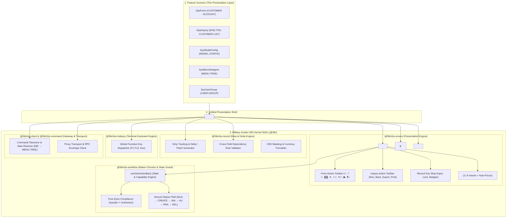

# 🏛️ CBS Enterprise Kernel Architecture: Military-Grade SDK Blueprint

> **Goal**: Create an unbreakable, zero-undo, enterprise Core Banking UI Kernel under `@/lib/`. 
> Every screen (Forms, Inquiries, System Designers, Admin Tables) delegates all state, actions, permissions, audit, validation, and hotkeys to this kernel. **Zero repeated UI code across feature screens.**

---

## 1. High-Level System Architecture Diagram



---

## 2. Complete Inventory of the 5 Core Kernel SDKs

To eliminate duplicate code forever and build a rock-solid banking terminal, `@/lib/` is organized into **5 specialized SDKs**:

| SDK Name | Responsibility | What It Solves (No More Redundant Code) |
| :--- | :--- | :--- |
| **1. `@/lib/cbs-screen`** | **Universal Presentation Shell** | Standard Action Header, Action Buttons, More Actions Menu, Validation Checklist Drawer with DOM focus, Audit Data Viewers, JSON Wire Viewers, Screen Scaffold. |
| **2. `@/lib/cbs-workflow`** | **State Machine & Maker-Checker Guard** | Determines exactly which button is enabled/disabled based on Screen Mode (`IDLE`, `CREATE`, `EDIT`, `VIEW`), Record Status (`NEW`, `INA`, `AU`, `HLD`, `RNA`), and User Roles (`I`, `A`, `D`, `H`, `R`). |
| **3. `@/lib/cbs-record`** | **Delta Engine & Formatters** | Computes only the changed fields (`diff`/`patch`) on save, formats CBS currency & account masks, and runs cross-field dependency rules. |
| **4. `@/lib/cbs-hotkeys`** | **Terminal Keyboard Engine** | Binds `F1`–`F12` and `Esc` to toolbar buttons globally so bank operators don't need a mouse. |
| **5. `@/lib/cbs-command` & `cbs-client`** | **Gateway & Microservice Transport** | Parses CBS command grammar (`ACCOUNT I 1001`), resolves aliases, and executes backend RPC requests. |

---

## 3. Deep Dive: The Unified Action Header Specification

The Action Header is divided into two distinct, predictable rows:

### Row 1: Primary Action Toolbar (32px / `h-8`)
```
+-------------------------------------------------------------------------------------------------------------------+
| [✓ Commit] [?✓ Validate] [❚❚ Hold] [✕ Delete] [✓✓ Auth] [✕✓ Rev] [▶ Process] [⬆ Return] | [More Actions ▼] | [⚠️ 1 Issue ▼] |
+-------------------------------------------------------------------------------------------------------------------+
```
* **Form Mode**: Displays CRUD / Maker-Checker buttons.
* **Inquiry Mode**: Displays `[Back]`, `[Refresh]`, `[Export CSV/HTML/XML ▼]`, `[Print ▼]`.
* **Right Area**: 
  - `[More Actions ▼]`: Built-in defaults (Print, Export JSON, Audit Log) + custom screen actions.
  - `[⚠️ N Issues]`: Pulsing badge when validation fails. Clicking it lists all failed fields and auto-scrolls the canvas to focus the exact input.

### Row 2: Record Key & Subheader Strip (28px / `h-7`)
```
+-------------------------------------------------------------------------------------------------------------------+
| Customer Master Record    [Input: Record ID... ▼] [+]                  [🔒 100123] [EDIT]            [CUSTOMER,RETAIL] |
+-------------------------------------------------------------------------------------------------------------------+
```
* **Title**: Descriptive screen title (e.g. `Customer Master Record`, `Data Model & Schema Config`).
* **Record Key Input (IDLE mode)**: Textbox with auto-complete dropdown + `+` (Create New) button.
* **Locked Badge (Active mode)**: `🔒 100123` with mode tag (`CREATE`, `EDIT`, `VIEW`).
* **Command Code (Far Right)**: `[CUSTOMER,RETAIL]`, `[MODEL.CONFIG]`, etc.

---

## 4. State & Capability Decision Matrix (`useCbsActionBar`)

Every button's enabled/disabled state is governed strictly by this deterministic matrix:

| Button | IDLE | CREATE | EDIT (`INA`) | EDIT (`AU`) | VIEW | Permission Required | Tooltip / Disable Reason |
| :--- | :---: | :---: | :---: | :---: | :---: | :---: | :--- |
| **`✓` Commit** | ❌ | ✅ | ✅ | ✅ | ❌ | `I` (Create) or `A` (Amend) | Disabled in VIEW mode. Requires Input/Amend rights. |
| **`?✓` Validate** | ❌ | ✅ | ✅ | ✅ | ❌ | `I` or `A` | Runs field rules & integrity checks without saving. |
| **`❚❚` Hold** | ❌ | ✅ | ✅ | ❌ | ❌ | `H` (Hold) | Puts uncommitted draft into HLD queue. |
| **`✕` Delete** | ❌ | ❌ | ✅ | ❌ | ❌ | `D` (Delete) | Cannot delete uncommitted new record. |
| **`✓✓` Authorize** | ❌ | ❌ | ✅ *(Checker)* | ❌ | ❌ | `A` (Authorise) | Requires status `INA` and Checker $\neq$ Maker (Four-Eyes). |
| **`✕✓` Rev Auth** | ❌ | ❌ | ❌ | ✅ | ❌ | `R` (Reverse) | Authorizes transaction reversal on committed records. |
| **`▶` Process** | ❌ | ✅ | ✅ | ✅ | ✅ | None | Executes end-of-stage verification process. |
| **`⬆` Return** | ❌ | ✅ | ✅ | ✅ | ✅ | None | Resets active screen back to search/idle state. |

---

## 5. Zero-Undo Implementation Phasing Plan

To implement this without breaking any active feature or creating merge conflicts:

### Phase 1: `@/lib/cbs-screen/hooks/use-cbs-action-bar.ts`
* Create the headless hook implementing the exact State & Capability Matrix above.
* **Test**: Verifiable with pure unit tests (zero UI changes).

### Phase 2: Refactor `<CbsFormHeader />` & `<CbsInquiryHeader />` into `<CbsActionHeader />`
* Create `<CbsActionHeader />` that delegates to `useCbsActionBar`.
* Provide backward-compatibility aliases so existing calls to `CbsFormHeader` continue working seamlessly without refactoring screens at once.

### Phase 3: Wire into `<CbsScreenScaffold />`
* Pass `variant="form" | "inquiry" | "admin-tabs"` directly into `<CbsActionHeader />`.
* Automatic `More Actions` merging (screen-specific items cleanly append to global defaults).

### Phase 4: Verification Across All Screens
* Run `pnpm tsc --noEmit` and test:
  1. `OpsForm` (`CUSTOMER`, `ACCOUNT`)
  2. `OpsInquiry` (`CUSTOMER.LIST`)
  3. `SysModelConfig` (`MODEL.CONFIG`)
  4. `SysMenuDesigner` (`MENU.TREE`)
  5. `SysMenuCatalog` (`MENU`)
  6. `SysUserGroup` (`USER.GROUP`)

---

## 6. How Any Screen Code Looks When Complete

Every screen in the codebase becomes ultra-compact, declarative, and completely worry-free:

```tsx
export function CustomerScreen({ command, tabId }: ScreenProps) {
  const { recordId, mode, data, errors, handleSubmit, handleValidate } = useCustomerRecord(command);

  return (
    <CbsScreenScaffold
      title="Customer Master Onboarding"
      commandCode="CUSTOMER"
      recordId={recordId}
      mode={mode}
      validationErrors={errors}
      onSubmit={handleSubmit}
      onValidate={handleValidate}
      moreActions={[
        { label: "Customer Balance Positions", onClick: openPositions },
        { label: "KYC Compliance Report", onClick: openKyc },
      ]}
    >
      <CustomerFormFields data={data} />
    </CbsScreenScaffold>
  );
}
```

> **Result**: No button state management, no tooltip code, no validation checklist markup, no hotkey listeners, and no audit footer code inside the feature screen. Everything is guaranteed 100% consistent across the bank portal.
