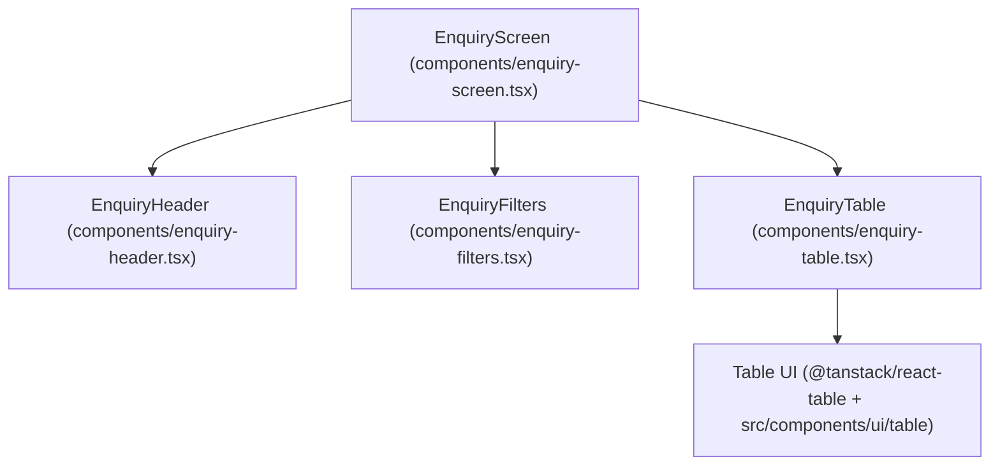

# 🔍 Inquiries Domain Architecture

## 1. Executive Summary & Purpose
This document specifies the architecture, data grid controls, search filter lifecycle, and bespoke screens for the Inquiries domain in `finxui-ref` located at [src/features/screens/enquiries/](file:///d:/CBS/In_house/finx/finxui-ref/src/features/screens/enquiries).

This feature manages high-density CBS enquiry screens, filter query bars, tabular result sets with pagination, and data export utilities.

---

## 2. Inquiries Flow & Components



---

## 3. Key Components & Colocation

- **`enquiry-screen.tsx`:** Primary coordinator component that manages filter state, search execution, and active data rows.
- **`enquiry-header.tsx`:** Standard CBS topbar with command title, action controls, and export triggers.
- **`enquiry-filters.tsx`:** High-density filter bar with field selectors and search inputs.
- **`enquiry-table.tsx`:** Paginated, sortable data grid utilizing `@tanstack/react-table`.
- **`enquiry-skeleton.tsx`:** Loading state skeleton placeholder.

---

## 4. Architectural Invariants & Rules

### Mandatory Rules (MUST)
- **MUST** render enquiry result tables using `@tanstack/react-table` combined with `shadcn/ui` table primitives.
- **MUST** format table header rows with uppercase headers and compact row heights for financial density.
- **MUST NOT** load un-paginated result sets over 1,000 rows without server-side pagination headers.

---

## 5. Verification Criteria

To verify enquiry functionality:
```bash
# Typecheck enquiry schemas and components
pnpm typecheck

# Lint check enquiry domain files
pnpm lint
```

---

## 6. Affected Documentation Updates
When modifying enquiry screens or data tables, update:
- [docs/devs/03-domain-features/inquiries.md](file:///d:/CBS/In_house/finx/finxui-ref/docs/devs/03-domain-features/inquiries.md)
- [docs/devs/01-architecture/code-review-standards.md](file:///d:/CBS/In_house/finx/finxui-ref/docs/devs/01-architecture/code-review-standards.md)

