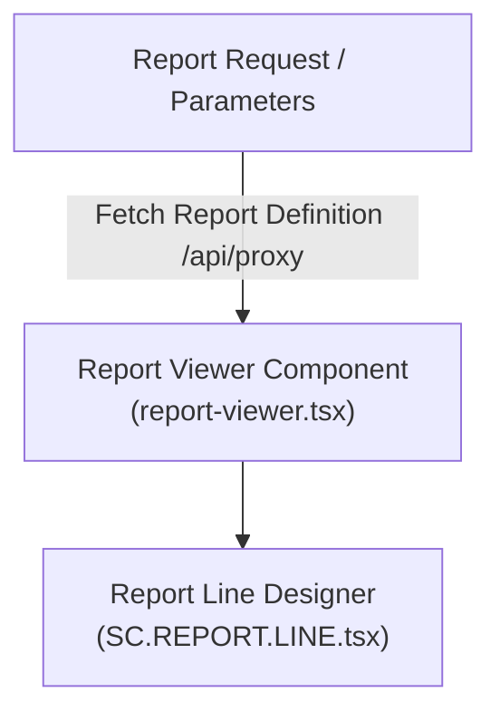

# 📊 Reporting Studio & Viewer Architecture

## 1. Executive Summary & Purpose
This document specifies the architecture, report line designer, and viewer subsystem of the Reporting domain in `finx-ui` located at [src/features/reporting/](file:///d:/CBS/In_house/finx/finxui-ref/src/features/reporting).

Reporting enables banking officers to view daily ledger summaries, transaction journals, close-of-business (COB) audit logs, and configure custom financial report layouts.

---

## 2. Reporting System Architecture



---

## 3. Key Components & Overrides

- **`SC.REPORT.LINE.tsx`:** Bespoke component override for building and configuring financial report line definitions and general ledger mappings.
- **Report Viewer:** High-density print-ready report grid rendering tool.

---

## 4. Architectural Rules & Security

### Mandatory Rules (MUST)
- **MUST** sanitize financial numbers and format currency values consistently.
- **MUST NOT** expose unredacted officer audit trails or customer PII in report exports without authorized session privileges.

---

## 5. Verification Criteria

To verify reporting functionality:
```bash
pnpm typecheck
pnpm lint
```

---

## 6. Affected Documentation Updates
When modifying report viewers or line designers, update:
- [docs/03-domain-features/reporting-studio.md](file:///d:/CBS/In_house/finx/finxui-ref/docs/03-domain-features/reporting-studio.md)
